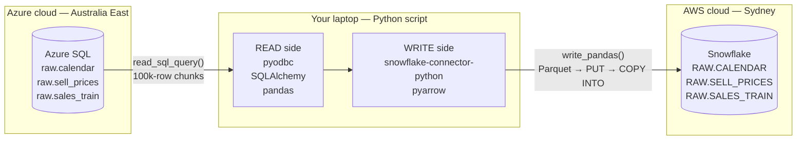

# Extract Pipeline — Azure SQL → Snowflake

> Phase 2 architecture walkthrough.
> Companion to `scripts/extract_azure_to_snowflake.py`.

A date-parameterised Python extract job that moves slices of the M5 retail
dataset from an Azure SQL source database into a Snowflake destination
warehouse. The same script serves two operating modes:

- **Backfill mode** — one wide date window, run once (e.g.
  `--start-date 2011-01-29 --end-date 2013-12-31`).
- **Incremental mode** — one date at a time, run on a schedule
  (Airflow, Phase 3) via `--run-date 2014-03-15`.

The 3-year backfill landed ~36 million rows from Azure SQL into Snowflake in
about 25 minutes through a single PowerShell command.

---

## Data flow



---

## Stage-by-stage walkthrough

### 1. Source — Azure SQL Database (Australia East)

The Phase 1 ingest landed the M5 dataset into an Azure SQL Database called
`sqldb-m5-source` on the Free Serverless tier. Three tables under the `raw`
schema:

- `raw.calendar` — 1,969 rows, one per day of the M5 horizon
- `raw.sell_prices` — 6.84M rows, weekly prices per item × store
- `raw.sales_train` — 59.18M rows, daily sales per item × store (unpivoted from the source's 1,941 wide day columns)

The database auto-pauses after about an hour of inactivity. The first
connection of any session triggers a wake-up that takes 30 to 60 seconds —
which has implications for how the extract script handles connection
timeouts.

### 2. Middleman — Python script on the laptop

The script's job is to pull a date-bounded slice from Azure SQL and write
it to Snowflake. PowerShell is just the launching shell; the Python
interpreter does the work.

The script's bones (see `scripts/extract_azure_to_snowflake.py`):

1. Parse CLI args (`--start-date`/`--end-date` for backfill or `--run-date`
   for a single day).
2. Open one connection to Azure SQL (via SQLAlchemy) and one to Snowflake.
3. Pull the `(date, d, wm_yr_wk)` mapping from `raw.calendar` for the window.
   This produces the list of `d` codes and fiscal weeks that the other two
   tables will be filtered by.
4. For each target table, execute the five-step shape:
   1. Build the date-filtered source SQL.
   2. Count rows in the source (**pre-flight verification**).
   3. `DELETE` any existing rows in Snowflake for the same window
      (**idempotency**).
   4. Stream-read rows in 100k-row pandas chunks; push each chunk to
      Snowflake via `write_pandas`.
   5. Verify source row count == destination row count
      (**post-action verification**).
5. Close connections, log total elapsed time.

### 3. Destination — Snowflake (AWS Sydney)

Snowflake is a cloud data warehouse. The account runs on AWS in the
`ap-southeast-2` region. Database `RETAIL_DB`, schema `RAW`, three target
tables mirroring the source shapes plus an audit column
`loaded_at TIMESTAMP_NTZ(9) DEFAULT CURRENT_TIMESTAMP()` that Snowflake
stamps automatically on insert.

Compute is the `WH_RETAIL` virtual warehouse, sized X-Small. Auto-suspends
after 60 seconds of inactivity — near-zero idle credit burn.

---

## The Python libraries

### Read side (Azure SQL → pandas DataFrame in memory)

- **`pyodbc`** — the low-level database driver. Speaks Microsoft's ODBC
  protocol to Azure SQL over TLS.
- **`SQLAlchemy`** — a Python toolkit one layer above pyodbc. Wraps the
  driver, provides `create_engine()`, manages connection pooling, and
  integrates cleanly with pandas.
- **`pandas`** — the in-memory tabular data library. `read_sql_query()`
  runs the SQL via SQLAlchemy and returns rows as a DataFrame; with
  `chunksize=` it returns an _iterator_ of smaller DataFrames.

### Write side (pandas DataFrame → Snowflake)

- **`snowflake-connector-python`** — Snowflake's official Python connector.
  The `[pandas]` extra pulls in pyarrow and unlocks the bulk-load function.
- **`pyarrow`** — pulled in transitively by the `[pandas]` extra. Encodes
  pandas DataFrames into Parquet (columnar binary file format) on the fly
  during bulk load.

---

## The two key function calls

### `pandas.read_sql_query(sql, engine, params=..., chunksize=100_000)`

Reads from Azure SQL. With `chunksize=100_000` it returns an iterator —
each iteration yields the next 100,000 rows as a DataFrame. The full
result set never lives in RAM as a single object.

```python
read_iter = pd.read_sql_query(
    src_sql,
    az_engine,
    params=tuple(d_values),    # ~1,068 d codes for the 3-year window
    chunksize=100_000,
)
for chunk in read_iter:
    write_pandas(conn_sf, chunk, table_name="SALES_TRAIN", ...)
```

### `snowflake.connector.pandas_tools.write_pandas(conn, df, table_name=..., ...)`

Bulk-loads a DataFrame into a Snowflake table. Internally three steps,
all transparent:

1. **Encode to Parquet.** The DataFrame becomes a compact columnar
   binary file on disk.
2. **`PUT` to internal stage.** The Parquet file is uploaded to a managed
   staging area inside Snowflake.
3. **`COPY INTO` target table.** Snowflake ingests the staged file using
   its parallel micro-partition writer.

One Python call, three under-the-hood operations. Throughput on the
3-year backfill: **~22,400 rows/sec sustained** for the 8-column
`sales_train` table, **~35,500 rows/sec** for the narrower `sell_prices`.

---

## Why this design holds up under interview scrutiny

- **Bounded RAM.** 100k-row chunks mean memory use is constant regardless
  of how big the date window is. The 3-year backfill peaks at ~10 MB of
  `sales_train` data in memory at any moment, not the 2-3 GB the full
  DataFrame would consume.
- **Idempotent re-runs.** Each per-table loader runs a `DELETE` on the
  target window _before_ the `INSERT`. If a backfill is interrupted
  partway through, restarting it is safe — no duplicates, no orphans.
- **Pre-flight + post-action verification.** Source row count captured
  before the load; destination row count confirmed equal after.
  Mismatches raise a `ValueError` with the specific table and the
  expected-vs-actual numbers. Catches data integrity issues at the
  extract level rather than letting them propagate downstream.
- **One wide query for backfill, one narrow query per day for
  incremental.** Same code, two modes. The wide-query backfill exploits
  the fact that Azure SQL's table-scan cost is roughly fixed per query —
  so a 3-year window is barely more expensive than a 1-day window.
  Predicted backfill cost if scaled naively from per-day timing:
  ~40 hours. Actual measured: ~25 minutes.
- **Observable progress.** Each 100k-row chunk emits a log line with row
  count, running total, and live throughput. Failures surface specific
  context (which chunk, which table, what the source counted vs what was
  written) rather than just a raw traceback.
- **Secrets externalised.** All credentials live in `.env` (gitignored).
  TLS in transit (`Encrypt=yes`). Server cert validated
  (`TrustServerCertificate=no`). 90-second connect timeout to survive
  Azure SQL Free Serverless's cold-start wake.

---

## What's next (Phase 3 and beyond — already shipped)

> Note (2026-05-17): Phases 3 and 4 are now complete. This section captures
> the original "what comes next from Phase 2's perspective" framing; for the
> actual Phase 4 dbt + Airflow Cosmos integration walkthrough, see
> `DBT_PIPELINE.md` → "Airflow orchestration of dbt — Astronomer Cosmos
> integration". The `m5_daily_extract` DAG documented below now extends to
> four stages: `extract_one_day → verify_one_day → [dbt_models task group,
> 18 auto-generated tasks] → verify_dbt_one_day`.

## What's next (original Phase 3 framing)

The same script becomes a single task in an Airflow DAG, called once per
scheduled run with `--run-date {{ ds }}`. The two-mode design means
nothing about the script changes between standalone backfill and
orchestrated daily run — Airflow just supplies the date argument.
