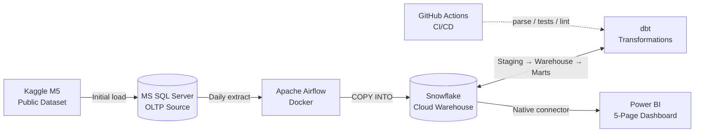
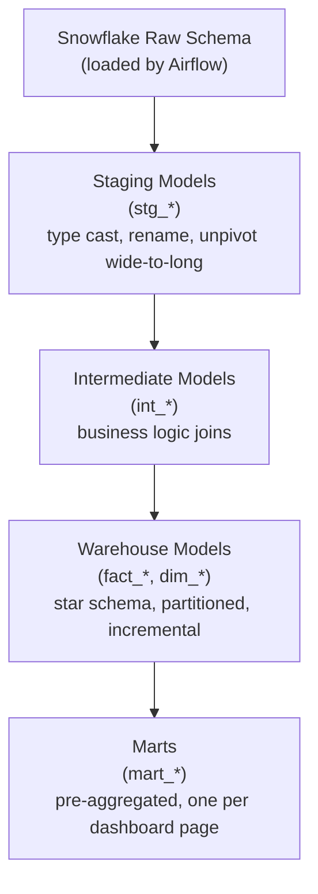

# Retail Demand & Forecasting Pipeline — Project Plan

> Working document for Project #2 of the data engineering portfolio.
> Architecture diagram and overview are employer-shareable.
> Created: 2026-05-09. Updated as work progresses.

---

## At a glance

A **production-grade retail demand-planning analytics platform** built end-to-end on a hybrid Microsoft + modern-data-stack architecture. Real Walmart sales data (M5 dataset) is ingested from MS SQL Server into a Snowflake cloud warehouse via scheduled Airflow jobs, transformed through a partitioned star schema with dedicated marts using dbt, and surfaced as a five-page Power BI dashboard for an operations / S&OP audience.

**The headline:** orchestration. The pipeline runs end-to-end on a schedule, with proper failure handling, tests, and CI — not button-pressed like Project #1.

| | |
|---|---|
| **Project name** | Retail Demand & Forecasting Pipeline |
| **Repo slug** | `retail-demand-forecasting-project` |
| **Domain** | Retail demand planning, S&OP operations, forecasting |
| **Dataset** | M5 Forecasting (Kaggle, public — Walmart daily sales 2011–2016) |
| **Estimated effort** | 12–16 sessions × 2–3 hours each (~30–45 hours total) |

---

## Architecture

GitHub renders this Mermaid block natively — no image export needed.

### dbt layering

---

## Locked decisions (no more drift)

| Decision | Choice |
|---|---|
| **Project name** | Retail Demand & Forecasting Pipeline |
| **Repo slug** | `retail-demand-forecasting-project` |
| **Domain** | Retail demand planning, S&OP operations, forecasting (forecast surfacing only — no ML modelling pipeline) |
| **Source database** | MS SQL Server (Docker locally OR Azure SQL — pending Azure portal check) |
| **Dataset** | M5 Forecasting (Kaggle, public) |
| **Cloud warehouse** | Snowflake (free trial, sign up when ready in Phase 2) |
| **Transformation** | dbt-snowflake with `dbt_utils`, tests, packages, marts layer |
| **Architecture** | Kimball star + dedicated marts + partitioned incremental fact builds |
| **Orchestration** | Apache Airflow in Docker |
| **BI tool** | Power BI (Service if licence allows, Desktop otherwise) |
| **CI/CD** | GitHub Actions running `dbt parse` + tests + `sqlfluff` (stretch goal) |
| **API ingestion** | Deferred to Project #3 (financial markets / lakehouse) |
| **Forecasting modelling** | Deferred (forecast surfacing in dbt only — 28-day baseline) |

---

## Pre-flight checklist

Run through these **before opening any folder or touching code**. Each is a 5–10-minute check.

### Hardware & dev environment

- [ ] **RAM available.** Task Manager → Performance → Memory. Target ≥ 16 GB free; ≥ 8 GB workable with leaner stack
- [ ] **Disk space.** Need ~30 GB free (M5 raw + database + Docker images)
- [ ] **Docker Desktop installed and running** (with WSL 2 backend on Windows). If not, install from docker.com
- [ ] **VS Code installed** with extensions: Python, Docker, dbt Power User (or similar), SQL Server (mssql), Snowflake (optional)
- [ ] **Python 3.11+** available on PATH (or fresh install)
- [ ] **Git** installed and signed in (PAT or SSH key working from Project #1)

### Accounts & licences

- [ ] **Kaggle account.** Sign up at kaggle.com (free), accept M5 competition rules at kaggle.com/competitions/m5-forecasting-accuracy/data
- [ ] **Kaggle API token** generated under Account → API → Create New Token (saves the `kaggle.json` file — needed for scripted download)
- [ ] **Azure portal check.** Sign in at portal.azure.com → Subscriptions. Note status: free trial active / used / never used. Determines whether MS SQL Server runs in Docker locally or as Azure SQL Database
- [ ] **Microsoft 365 / Power BI Service licence?** Note Y/N. If Y, plan to publish dashboard. If N, Desktop + screenshots in README is fine
- [ ] **GitHub account active and SSH/PAT working** (carryover from Project #1)
- [ ] **Snowflake free trial: do NOT sign up yet.** 30-day clock starts on signup. Wait until Phase 2

### Decisions to confirm post-checklist

- [ ] MS SQL Server hosting: Docker locally / Azure SQL Database / other
- [ ] Power BI publication: Service (live link) / Desktop (screenshots)
- [ ] CI/CD scope: in-scope from Phase 5 / stretch only

---

## Session-by-session timeline

Sessions are ~2–3 hours each. Times are honest estimates including troubleshooting. Pace is up to you — this is a "couple of sessions a week" or "every day if motivated" plan, not a deadline.

| Phase | Sessions | What happens | Deliverables at end |
|---|---|---|---|
| **Phase 0 — Setup** | 1 | Pre-flight checks confirmed. Final hosting decisions. Repo created on GitHub (public). Folder structure scaffolded with `README.md`, `LEARNINGS.md`, `PROJECT_CONTEXT.md`, `.gitignore`. Python venv. Naming conventions document committed. First commit pushed | Empty repo, conventions doc, README skeleton |
| **Phase 1 — Source database** | 1–2 | MS SQL Server up (Docker or Azure SQL). Connect from VS Code / Azure Data Studio. M5 raw CSVs downloaded from Kaggle. Bulk load all 5 M5 files into MS SQL Server. Verify row counts, character encoding, sample queries | 6 raw tables in MS SQL Server with verified data |
| **Phase 2 — Snowflake + extraction** | 2–3 | Snowflake free trial signed up (clock starts). Warehouse / database / schema / role provisioned. Python extract-and-load job: MS SQL → Snowflake staging via `pyodbc` → Pandas → `snowflake-connector-python` → `COPY INTO`. Test single-table extract first, then all-tables | All 6 raw tables landed in Snowflake `RAW` schema |
| **Phase 3 — Airflow orchestration** | 2 | Airflow Docker compose stack up locally. First DAG: extract MS SQL → load Snowflake → run on schedule. Failure handling and email/log alerts. Containerise the Python extract job. Manual trigger and scheduled trigger both validated | Working DAG runs end-to-end on schedule |
| **Phase 4 — dbt transformations** | 3–4 | dbt-snowflake configured. Sources defined. **Staging layer** (incl. wide-to-long unpivot of M5 sales). Intermediate. **Warehouse layer**: `dim_item`, `dim_store`, `dim_calendar`, `fact_daily_sales` (partitioned, incremental). dbt tests on every dim's primary key. Surrogate keys via `dbt_utils.generate_surrogate_key`. **Marts layer**: one mart per dashboard page (5 marts) | Full dbt project building cleanly with passing tests |
| **Phase 5 — Power BI** | 2–3 | Snowflake native connector configured. Five marts loaded. Relationships established (single-direction Many-to-One). Five pages built: Executive Overview, Demand by Hierarchy, Promotion & Price Analysis, Seasonality & Calendar, Forecast vs Actual. Cross-page sync slicers. Drill-throughs. Format painter pass for consistency. DAX measures explicit (not implicit). Theme applied | Polished `.pbix` file with 5 pages |
| **Phase 6 — Polish & ship** | 1–2 | README expanded with architecture diagram, screenshots, "how to run" section, business problem statement, tech-stack rationale. `LEARNINGS.md` final pass. Stretch: GitHub Actions CI workflow with `dbt parse`, tests, `sqlfluff` lint. Tag `v1.0` release. Public repo confirmed | Shippable portfolio piece |
| **Total** | **12–16** | | |

---

## Carry-forward principles from Project #1

These are non-negotiable from day 1, locked from `LEARNINGS.md` carry-forward section.

1. **Git initialised and pushed to GitHub before any other work.** First commit = empty repo. Public from day 1
2. **`LEARNINGS.md` and `README.md` created day one**, updated mid-project not just at end
3. **dbt tests on every dim's primary key** (`unique` and `not_null` minimum)
4. **`feed_id` / source identifier carried through every layer** — even though M5 is single-source, this discipline applies for any reference data joined in
5. **Naming conventions decided and documented BEFORE building any models** (see below)
6. **`dbt_utils.generate_surrogate_key()`** for surrogate keys — not manual `||` concatenation
7. **All display logic in dbt**, not Power BI — pretty labels live in the warehouse
8. **Verify column units against actual data on ingestion** — don't trust column-name suffixes
9. **`::INTERVAL` over `::TIME`** for any time arithmetic that might hit edge cases
10. **Architectural decisions documented as they're made** — every dbt-vs-DAX-vs-mart call captured in `LEARNINGS.md` with a one-liner

### Naming conventions

| Object | Convention | Example |
|---|---|---|
| All identifiers | `snake_case` | `daily_sales` |
| Surrogate keys | `<entity>_key` | `item_key`, `store_key` |
| Natural / business keys | `<entity>_id` | `item_id`, `store_id` |
| Fact tables | `fact_<grain>_<entity>` | `fact_daily_sales` |
| Dim tables | `dim_<entity>` | `dim_item`, `dim_store`, `dim_calendar` |
| Staging models | `stg_<source>_<entity>` | `stg_m5_sales` |
| Intermediate models | `int_<purpose>` | `int_sales_with_prices` |
| Mart models | `mart_<purpose>` | `mart_daily_sales_by_store` |
| Date column in facts | `sale_date` (DATE type, partition key) | |
| Currency / amounts | `<noun>_amount_usd` (units in name) | `revenue_amount_usd` |

---

## Risk register & mitigations

| Risk | Likelihood | Impact | Mitigation |
|---|---|---|---|
| RAM constraint (Docker stack heavy) | Medium | High | Pre-flight RAM check; fall back to Airflow LocalExecutor or Azure SQL if tight |
| Snowflake 30-day trial expires mid-project | Medium | Medium | Don't sign up until Phase 2. X-SMALL warehouse only. Suspend when not in use |
| M5 wide-to-long shape causes ingestion confusion | Low | Low | Plan unpivot in dbt staging from day 1 — flagged in `stg_m5_sales` |
| Power BI choking on 58M-row raw fact | Low | High | Discipline rule: Power BI only ever connects to `marts/` — never raw or warehouse-fact |
| UTF-8 / encoding bugs (Project #1 repeat) | Low | Medium | Explicit `encoding='utf-8'` on all Python file ops. `nvarchar` (not `varchar`) in MS SQL Server |
| Naming inconsistency drift | Medium | Medium | Conventions table above is committed to repo Phase 0. No exceptions |
| Airflow first-time-setup pain | High | Medium | Use Astronomer's official `docker-compose.yml` template — well-documented, low-friction starting point |
| Scope creep (forecasting ML, weather API, more pages) | High | Medium | This document is the contract. Anything not listed is Project #3 candidate or stretch goal |
| Auto-detected relationships in Power BI (Project #1 repeat) | Medium | Low | Disable autodetect on first model load. Manage Relationships pass after every refresh |

---

## Definition of "shippable"

Project #2 ships when **all of these** are true:

- Pipeline runs end-to-end automatically (Airflow scheduled, not button-pressed)
- All dbt models have at least basic tests; tests pass
- Cloud warehouse (Snowflake), not local
- Architecture diagram in README (the Mermaid block above)
- README explains the business problem, the architecture, and how to run it
- At least one screenshot OR live link of the Power BI dashboard
- `LEARNINGS.md` populated through the project (not just end)
- Repo public on GitHub from day 1
- Tagged `v1.0` release

**Stretch goals** (nice but not required for shippable):

- CI passing on `main` branch (green badge in README)
- Power BI Service live link instead of screenshots
- `dbt docs generate` hosted on GitHub Pages
- `.env` secrets via Airflow connections (not file-based)

---

## What this project deliberately does NOT do

To avoid scope creep, these are out:

- **Forecasting modelling pipeline** (Prophet, ML models) — surfacing only. Defer to Project #3 if applicable
- **Streaming / real-time** ingestion. Batch monthly (or weekly) is the headline
- **Multiple cloud providers.** Snowflake on AWS-backed default region; nothing on Azure/GCP simultaneously
- **API ingestion.** Reserved for Project #3
- **Lakehouse / medallion architecture.** Reserved for Project #3
- **Multiple BI tools.** Power BI only — Tableau or Looker are scope creep here

---

## Cross-references

- `TEACHING_PREFERENCES.md` — how Phil works with Claude (carry-forward, not project-specific)
- `LEARNINGS.md` — running journal, populated as the project progresses
- `PROJECT_CONTEXT.md` — current state and immediate next steps (created Phase 0)
- `README.md` — public-facing project intro for hiring managers (built up over Phase 6)

---

## Status

| | |
|---|---|
| **Phase** | Pre-Phase 0 (planning) |
| **Last updated** | 2026-05-09 |
| **Next step** | Run pre-flight checklist, report results, then begin Phase 0 |
