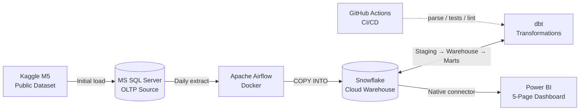
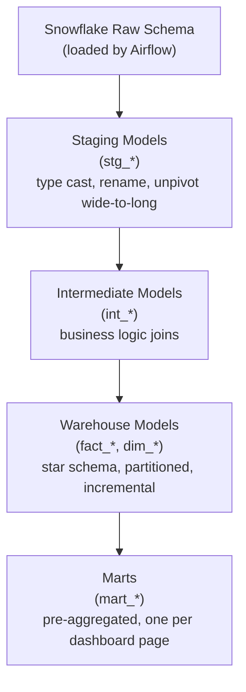

# Retail Demand & Forecasting Pipeline — Project Plan

> Working document for Project #2 of the data engineering portfolio.
> Architecture diagram and overview are employer-shareable.
> Created: 2026-05-09. Last meaningfully updated: 2026-05-15 (Phase 3 in flight).

---

## At a glance

A **production-grade retail demand-planning analytics platform** built end-to-end on a hybrid Microsoft + modern-data-stack architecture. Real Walmart sales data (M5 dataset) is ingested from MS SQL Server into a Snowflake cloud warehouse via scheduled Airflow jobs, transformed through a partitioned star schema with dedicated marts using dbt, and surfaced as a five-page Power BI dashboard for an operations / S&OP audience.

**The headline:** orchestration. The pipeline runs end-to-end on a schedule, with proper failure handling, tests, and CI — not button-pressed like Project #1.

|                      |                                                                 |
| -------------------- | --------------------------------------------------------------- |
| **Project name**     | Retail Demand & Forecasting Pipeline                            |
| **Repo slug**        | `retail-demand-forecasting-project`                             |
| **Domain**           | Retail demand planning, S&OP operations, forecasting            |
| **Dataset**          | M5 Forecasting (Kaggle, public — Walmart daily sales 2011–2016) |
| **Estimated effort** | 12–16 sessions × 2–3 hours each (~30–45 hours total)            |

---

## Architecture

GitHub renders this Mermaid block natively — no image export needed.

### dbt layering

---

## Locked decisions (no more drift)

| Decision                  | Choice                                                                                                                                                                                                                                                                                                                                        |
| ------------------------- | --------------------------------------------------------------------------------------------------------------------------------------------------------------------------------------------------------------------------------------------------------------------------------------------------------------------------------------------- |
| **Project name**          | Retail Demand & Forecasting Pipeline                                                                                                                                                                                                                                                                                                          |
| **Repo slug**             | `retail-demand-forecasting-project`                                                                                                                                                                                                                                                                                                           |
| **Domain**                | Retail demand planning, S&OP operations, forecasting (forecast surfacing only — no ML modelling pipeline)                                                                                                                                                                                                                                     |
| **Source database**       | Azure SQL Database — Serverless General Purpose Free tier with auto-pause                                                                                                                                                                                                                                                                     |
| **Dataset**               | M5 Forecasting (Kaggle, public)                                                                                                                                                                                                                                                                                                               |
| **Cloud warehouse**       | Snowflake (free trial, sign up when ready in Phase 2)                                                                                                                                                                                                                                                                                         |
| **Transformation**        | dbt-snowflake with `dbt_utils`, tests, packages, marts layer                                                                                                                                                                                                                                                                                  |
| **Architecture**          | Kimball star + lean marts (analyst-facing) + partitioned incremental fact builds. Power BI consumes the warehouse star (fact + dims) directly for slice/dice flexibility; marts hold pre-aggregations only where they earn their keep. See `LEARNINGS.md` → "2026-05-17 — Lean marts layer + analyst-facing star schema". |
| **Orchestration**         | Apache Airflow in Docker                                                                                                                                                                                                                                                                                                                      |
| **BI tool**               | Power BI (Service if licence allows, Desktop otherwise)                                                                                                                                                                                                                                                                                       |
| **CI/CD**                 | GitHub Actions running `dbt parse` + tests + `sqlfluff` (stretch goal)                                                                                                                                                                                                                                                                        |
| **API ingestion**         | Deferred to Project #3 (financial markets / lakehouse)                                                                                                                                                                                                                                                                                        |
| **Forecasting modelling** | Deferred (forecast surfacing in dbt only — 28-day baseline)                                                                                                                                                                                                                                                                                   |
| **Ingestion pattern**     | **Simulated freshness (Option B):** all M5 history bulk-loaded into Azure SQL once. Airflow DAG extracts ONE date-partitioned slice per scheduled run (`WHERE sale_date BETWEEN '{{ data_interval_start }}' AND '{{ data_interval_end }}'`). Makes incremental dbt models, tests, and alerts behave like a live pipeline rather than theatre. |

---

## Pre-flight checklist

Pre-flight checklist completed during Phase 0.
See `PROJECT_CONTEXT.md` → "Pre-flight check results" for the verified state.

### Decisions confirmed post-checklist

- Source database hosting: **Azure SQL Database** (Serverless General Purpose Free tier, auto-pause).
- Power BI publication: **Desktop + screenshots in README** (no Service licence).
- CI/CD scope: **stretch goal only** — `dbt parse` + tests + `sqlfluff` via GitHub Actions if time allows in Phase 6.

---

## Session-by-session timeline

Sessions are ~2–3 hours each. Times are honest estimates including troubleshooting. Pace is up to you — this is a "couple of sessions a week" or "every day if motivated" plan, not a deadline.

| Phase                                | Sessions  | What happens                                                                                                                                                                                                                                                                                                                                                                             | Deliverables at end                                                                    |
| ------------------------------------ | --------- | ---------------------------------------------------------------------------------------------------------------------------------------------------------------------------------------------------------------------------------------------------------------------------------------------------------------------------------------------------------------------------------------- | -------------------------------------------------------------------------------------- |
| **Phase 0 — Setup**                  | 1         | Pre-flight checks confirmed. Final hosting decisions. Repo created on GitHub (public). Folder structure scaffolded with `README.md`, `LEARNINGS.md`, `PROJECT_CONTEXT.md`, `.gitignore`. Python venv. Naming conventions document committed. First commit pushed                                                                                                                         | Empty repo, conventions doc, README skeleton                                           |
| **Phase 1 — Source database**        | 1–2       | MS SQL Server up (Docker or Azure SQL). Connect from VS Code / Azure Data Studio. M5 raw CSVs downloaded from Kaggle. Bulk load all 5 M5 files into MS SQL Server. Verify row counts, character encoding, sample queries                                                                                                                                                                 | 6 raw tables in MS SQL Server with verified data                                       |
| **Phase 2 — Snowflake + extraction** | 2–3       | Snowflake free trial signed up (clock starts). Warehouse / database / schema / role provisioned. Python extract-and-load job: MS SQL → Snowflake staging via `pyodbc` → Pandas → `snowflake-connector-python` → `COPY INTO`. **Extract is date-parameterised from day 1** (takes a `run_date` arg). Test single-table extract first, then all-tables                                     | All 6 raw tables landed in Snowflake `RAW` schema; extract script accepts a date param |
| **Phase 3 — Airflow orchestration**  | 2         | Airflow Docker compose stack up locally. First DAG: extract MS SQL → load Snowflake → run on schedule, **passing `{{ data_interval_start }}` to the date-parameterised extract so each run picks up one new day of M5 history (simulated freshness)**. Failure handling and email/log alerts. Containerise the Python extract job. Manual trigger and scheduled trigger both validated   | Working DAG runs end-to-end on schedule, advancing one M5 day per run                  |
| **Phase 4 — dbt transformations + orchestration**    | 5–6       | dbt-snowflake configured. Sources defined. **Staging layer** (M5 already long from Python load). **Intermediate layer**: `int_sales_with_prices`. **Warehouse layer**: `dim_item`, `dim_store`, `dim_calendar`, `fact_daily_sales` (incremental, clustered on `sale_date`). dbt tests on every dim's primary key. Surrogate keys via `dbt_utils.generate_surrogate_key`. **Marts layer (lean):** `mart_executive_overview` only — pre-aggregated daily summary for the home page. Other Power BI pages slice the warehouse star directly. See `LEARNINGS.md` "Lean marts layer" entry. **Phase 4 closes with Airflow ↔ dbt wiring via Astronomer Cosmos** (session 6) so each dbt model becomes its own Airflow task in the existing `m5_daily_extract` DAG, with full lineage visible in the Airflow UI. | Full dbt project building cleanly with passing tests + Airflow-orchestrated dbt build |
| **Phase 5 — Power BI + forecasting**  | 5–6       | Snowflake native connector configured (DirectQuery vs Import evaluated empirically per page). Power BI semantic model with relationships from `WAREHOUSE.fact_*` + `dim_*` (lean-marts pattern). **All five pages fully built**: Executive Overview (from `mart_executive_overview`), Demand by Hierarchy, Promotion & Price, Seasonality & Calendar, Forecast vs Actual. **Forecasting layer built end-to-end** — time-series forecasts via Snowflake Cortex ML functions (or Python statsmodels / Prophet — decided session 5 open), results written back to Snowflake, new `mart_forecast_vs_actual` dbt model joining forecasts to fact, `is_incremental` patterns where appropriate. Full DAX measure library (time intelligence, period-over-period, dynamic top-N, dynamic format strings). Cross-page sync slicers, drill-throughs, theme. Performance tuning (VertiPaq compression analysis, BI-side aggregations if needed). `POWERBI_PIPELINE.md` walkthrough doc shipped matching EXTRACT_PIPELINE / DBT_PIPELINE depth | Polished `.pbix` file with 5 fully-built pages including working forecasts + new mart |
| **Phase 6 — CI/CD + ship**            | 2–3       | README expanded with architecture diagram, screenshots of all 5 Power BI pages, "how to run" section, business problem statement, tech-stack rationale, key learnings. **GitHub Actions CI fully wired** (no longer stretch): `dbt parse` + `dbt test` + dbt slim CI (only changed models + downstream) + `sqlfluff` lint + markdown lint, green badge in README. **`dbt docs generate` hosted on GitHub Pages** (no longer stretch). `LEARNINGS.md` final pass + "What I'd do differently next time" populated. Final closing 10-point + phase-boundary structural audit across the whole project. Tag `v1.0` release. Public repo confirmed | Complete portfolio-grade project, all stretch goals shipped as baseline |
| **Total**                            | **18–23** |                                                                                                                                                                                                                                                                                                                                                                                          |                                                                                        |

---

## Carry-forward principles from Project #1

These are non-negotiable from day 1, locked from `LEARNINGS.md` carry-forward section.

1. **Git initialised and pushed to GitHub before any other work.** First commit = empty repo. Public from day 1
2. **`LEARNINGS.md` and `README.md` created day one**, updated mid-project not just at end
3. **dbt tests on every dim's primary key** (`unique` and `not_null` minimum)
4. **`feed_id` / source identifier carried through every layer** — even though M5 is single-source, this discipline applies for any reference data joined in
5. **Naming conventions decided and documented BEFORE building any models** (see below)
6. **`dbt_utils.generate_surrogate_key()`** for surrogate keys — not manual `||` concatenation
7. **All display logic in dbt**, not Power BI — pretty labels live in the warehouse
8. **Verify column units against actual data on ingestion** — don't trust column-name suffixes
9. **`::INTERVAL` over `::TIME`** for any time arithmetic that might hit edge cases
10. **Architectural decisions documented as they're made** — every dbt-vs-DAX-vs-mart call captured in `LEARNINGS.md` with a one-liner

### Naming conventions

| Object                  | Convention                             | Example                                 |
| ----------------------- | -------------------------------------- | --------------------------------------- |
| All identifiers         | `snake_case`                           | `daily_sales`                           |
| Surrogate keys          | `<entity>_key`                         | `item_key`, `store_key`                 |
| Natural / business keys | `<entity>_id`                          | `item_id`, `store_id`                   |
| Fact tables             | `fact_<grain>_<entity>`                | `fact_daily_sales`                      |
| Dim tables              | `dim_<entity>`                         | `dim_item`, `dim_store`, `dim_calendar` |
| Staging models          | `stg_<source>_<entity>`                | `stg_m5_sales`                          |
| Intermediate models     | `int_<purpose>`                        | `int_sales_with_prices`                 |
| Mart models             | `mart_<purpose>`                       | `mart_daily_sales_by_store`             |
| Date column in facts    | `sale_date` (DATE type, partition key) |                                         |
| Currency / amounts      | `<noun>_amount_usd` (units in name)    | `revenue_amount_usd`                    |

---

## Risk register & mitigations

| Risk                                                        | Likelihood | Impact | Mitigation                                                                                             |
| ----------------------------------------------------------- | ---------- | ------ | ------------------------------------------------------------------------------------------------------ |
| RAM constraint (Docker stack heavy)                         | Medium     | High   | Pre-flight RAM check; fall back to Airflow LocalExecutor or Azure SQL if tight                         |
| Snowflake 30-day trial expires mid-project                  | Medium     | Medium | Don't sign up until Phase 2. X-SMALL warehouse only. Suspend when not in use                           |
| M5 wide-to-long shape causes ingestion confusion            | Low        | Low    | Plan unpivot in dbt staging from day 1 — flagged in `stg_m5_sales`                                     |
| Power BI choking on 32.9M-row warehouse fact                | Low        | Medium | **Superseded 2026-05-17.** Power BI connects to `WAREHOUSE.fact_*` + `dim_*` directly for analyst-facing pages, and to `MARTS.mart_*` for pre-aggregated rollups. VertiPaq compression handles the fact size on Snowflake's XS warehouse. Empirically verify before relying on it. |
| UTF-8 / encoding bugs (Project #1 repeat)                   | Low        | Medium | Explicit `encoding='utf-8'` on all Python file ops. `nvarchar` (not `varchar`) in MS SQL Server        |
| Naming inconsistency drift                                  | Medium     | Medium | Conventions table above is committed to repo Phase 0. No exceptions                                    |
| Airflow first-time-setup pain                               | High       | Medium | Use Astronomer's official `docker-compose.yml` template — well-documented, low-friction starting point |
| Scope creep (weather API, additional pages, lakehouse)      | Medium     | Medium | **Updated 2026-05-17**: forecasting is now in-scope (M5 is literally a forecasting dataset; deferring it weakens the portfolio narrative). Weather API, additional pages, lakehouse architecture remain out-of-scope and reserved for Project #3. This document is the contract |
| Auto-detected relationships in Power BI (Project #1 repeat) | Medium     | Low    | Disable autodetect on first model load. Manage Relationships pass after every refresh                  |

---

## Definition of "shippable"

Project #2 ships when **all of these** are true (updated 2026-05-17 — former stretch goals promoted to baseline; full scope locked in):

- Pipeline runs end-to-end automatically (Airflow scheduled, not button-pressed)
- All dbt models have at least basic tests; tests pass
- Cloud warehouse (Snowflake), not local
- Architecture diagram in README (the Mermaid block above)
- README explains the business problem, the architecture, and how to run it
- Screenshots of **all five** Power BI pages in the README (not just one)
- All five pages fully built — Executive Overview, Demand by Hierarchy, Promotion & Price, Seasonality & Calendar, **Forecast vs Actual with working forecasts** (not stubbed)
- Forecasting layer built end-to-end — model trained or Cortex invoked, results written back to Snowflake, joined to fact via `mart_forecast_vs_actual`
- `LEARNINGS.md` populated through the project (not just end)
- Repo public on GitHub from day 1
- **GitHub Actions CI passing on `main` branch** (green badge in README)
- **`dbt docs generate` hosted on GitHub Pages**
- Tagged `v1.0` release

**Remaining stretch goals** (genuinely optional, would not block shipping):

- Power BI Service live link (in addition to screenshots)
- `.env` secrets migrated to Airflow Connections (refactor, not feature)
- `dbt-snowflake` upgrade to whatever the latest minor is at v1.0 time

---

## What this project deliberately does NOT do

To avoid scope creep, these remain out (updated 2026-05-17 — forecasting removed from this list and moved into Phase 5 in-scope):

- **Streaming / real-time** ingestion. Batch daily is the headline cadence
- **Multiple cloud providers.** Snowflake on AWS-backed default region; nothing on Azure/GCP simultaneously
- **API ingestion.** Reserved for Project #3
- **Lakehouse / medallion architecture.** Reserved for Project #3
- **Multiple BI tools.** Power BI only — Tableau or Looker are scope creep here
- **Deep ML / hyperparameter tuning.** The forecasting layer uses one or two well-chosen out-of-the-box methods (Snowflake Cortex ML functions, or Prophet / exponential smoothing in Python); model evaluation is included but bake-off / extensive feature engineering is reserved for any future ML-specific project

---

## Cross-references

- `TEACHING_PREFERENCES.md` — how Phil works with Claude (carry-forward, not project-specific)
- `LEARNINGS.md` — running journal, populated as the project progresses
- `PROJECT_CONTEXT.md` — current state and immediate next steps (created Phase 0)
- `README.md` — public-facing project intro for hiring managers (built up over Phase 6)

---

## Status

|                  |                                                                        |
| ---------------- | ---------------------------------------------------------------------- |
| **Phase**        | Phase 5 — session 5.9 **closed**. **Phase 5 COMPLETE.** End-to-end DAG smoke test executed across 2 fresh dates (2014-03-24 and 2014-03-25), all 4 tasks (extract → verify → dbt task group → verify_dbt) green after a mid-session debug loop. Two real bugs surfaced and fixed: (a) `mart_rows` NameError in verify_dbt_one_day's success-path return f-string — stale variable reference left behind from the 5.4 mart-check surgical removal, sat undiscovered for 6 sessions because the success path hadn't been exercised since 5.4; fix shipped as single-line f-string edit. (b) DAG architectural design fault — `schedule="@daily"` caused unpause-time auto-creation of a phantom DagRun for today's date (which tried to extract 2026-05-22 M5 data that doesn't exist in Azure SQL); changed to `schedule=None` with 7-line explanatory inline comment, making the DAG manual-trigger-only — correct pattern for a portfolio-demo project. 3 new Airflow LEARNINGS banked for Project #3 carry-forward: schedule=None vs production cron decision criteria, pause-mid-run trap with scheduler-stranded "scheduled" tasks (NEVER pause a DAG before its current run completes — sequence is unpause → trigger → let it complete → THEN pause), scan-all-references discipline when surgically removing variables from a function (SQL query / bind tuple / unpack line / log calls / success-path return f-string / failure-check block — success-path return is the easy-to-miss case because it only executes on the happy path). POWERBI_PLAYBOOK.md UDA stale references scrubbed in 3 surgical edits (§1.1 storage-mode table no longer lists AGG_SALES_DAILY / AGG_SALES_DAILY_ITEM_CAT since they're not in the PBI model per §1.4; §6 Phase C checklist Get Data line shortened to 6 tables with footnote pointing at §1.4; Manage Aggregations step marked SUPERSEDED with strikethrough). agg_sales_daily.sql + agg_sales_daily_item_cat.sql retained in dbt/models/marts/ as portfolio-narrative artifacts ("I built two pre-aggregated marts following the Kimball aggregate pattern, then learned UDA requires DirectQuery on the detail table — incompatible with all-Import — so kept the marts for the architectural story but didn't wire them into PBI"). PBI sanity verification: Home → Refresh, Data view → enabled View hidden → FACT_DAILY_SALES → SALE_DATE descending → top row Tuesday 25 March 2014 (was 2014-03-23 pre-smoke). Phantom 2026-05-22 DagRun retained in Airflow run history for portfolio narrative legibility. Next: Phase 6 — README screenshots of all 5 PBI pages + POWERBI_PIPELINE.md walkthrough fill-in matching EXTRACT_PIPELINE / DBT_PIPELINE depth for sessions 5.2-5.8 + README "Future-revival for Snowflake interview demo" paragraph + optional stretch items (VertiPaq Analyzer via DAX Studio standalone launch, ruff F821 CI pre-merge gate from 5.9 mart_rows LEARNING, GitHub Actions CI for dbt parse + test + sqlfluff) + final commit + tag v1.0 release. Total project: 18-23 sessions; ~21-22 sessions done; ~2-3 sessions remaining in Phase 6. Earlier closeout context: 5-page polish pass complete end-to-end at 5.8: Seasonality & Calendar (Day Type calc column for readable Weekday/Weekend axis; SNAP Day Type rewritten on existing column; titles renamed; Holiday Top N filter + $-formatted labels; heatmap green sequential gradient + Grow to fit column distribution + Don't format blank handling killing 2014 partial-year red; Row padding bump + Global font size 11 via Grid → Options) and Forecast vs Actual (Forecast Units companion KPI card; dashed Forecast + dotted Upper/Lower 95 styling on both line charts; last-90-days date zoom via un-synced Date slicer; matrix Power Query Replace Values for actual→Actual / forecast→Forecast + Rename for this visual dropping (Mart) suffix on column headers + Row padding + Grow to fit + No fill alternate background killing row banding). All 5 pages now interview-grade. Drill-through ATTEMPTED + PULLED: Item Detail destination page built and wired correctly per every documented spec, but right-click trigger did not fire in user's stock free PBI Desktop variant (community-cited Page type = Drillthrough toggle not exposed in Page information section of this variant); Item Detail page deleted. Theme cohesion verified across all 5 pages — City Park applied uniformly, design language locked (cat_id blue/purple/green; warm red callout; grey baseline; green sequential heat). VertiPaq Analyzer completed via DAX Studio standalone launch path (per-user install path didn't register External Tools ribbon, but Start Menu launch + Connect dialog → Power BI / SSDT Model radio works); .vpax exported to powerbi/ (76 KB) showing ~254 MB compressed model size, FACT_DAILY_SALES dominant at 67%, forecast layer 25%, columnar compression ~5 bytes/row/col average. 4 unused measures deleted (Revenue PY / Revenue YoY $ / Revenue YoY % / Revenue YTD — speculative time-intel for skipped YoY/YTD patterns); final measure count 16 on _Measures. Power Query bonus consolidation: 2 Replace Values steps on MART_FORECAST_VS_ACTUAL.SERIES_TYPE collapsed to 1 Capitalize Each Word (Text.Proper) step. 1 cyclic ref incident cleared via 5.5 close+reopen pattern after Power Query Replace Values; LEARNING refined to two-cause pattern (spurious cache vs real M-code self-reference). 7 durable LEARNINGS banked for Project #3 carry-forward (variant-specific control locations pinned; PBI build order discipline — theme + drill-through test EARLY; drill-through trigger unresolved variant issue; cyclic ref two-cause refinement; Power Query Replace Values as only categorical rename path; DAX Studio install path requirement; transformation layer hierarchy — do cleanup at lowest possible layer dbt → PQ → DAX → visual). Next: Phase 5 session 5.9 — end-to-end DAG smoke test (single date, fresh) before Phase 6 close. Then Phase 6 — README screenshots + POWERBI_PIPELINE.md walkthrough. Total project: 18-23 sessions; ~20-21 sessions done so far; ~1-2 sessions remaining |
| **Last updated** | 2026-05-22                                                             |
| **Next step**    | See `PROJECT_CONTEXT.md` → "Where we are right now" for the live state |
