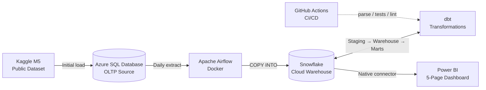

# Retail Demand & Forecasting Pipeline

> A production-grade retail demand-planning analytics platform built on a hybrid Microsoft + modern-data-stack architecture. Real Walmart sales data (M5 Forecasting) is ingested from Azure SQL Database into Snowflake via scheduled Airflow jobs, transformed through a partitioned star schema with dedicated marts using dbt, and surfaced as a five-page Power BI dashboard for an operations / S&OP audience.

**Status:** 🚧 In development — Phase 1 complete (Azure SQL source database loaded with M5 data: 1,969 calendar rows + 6.8M sell_prices + 59.18M sales_train). Phase 2 (Snowflake + extraction) next.

---

## What this project demonstrates

- **End-to-end pipeline** from operational source database to BI dashboard
- **Cloud warehouse** (Snowflake) and **cloud-hosted source** (Azure SQL Database)
- **Orchestrated execution** via Apache Airflow (Docker)
- **Production-grade dbt** with `dbt_utils`, tests, packages, partitioned incremental fact models, and a dedicated marts layer
- **Realistic enterprise pattern**: relational source (representing an ERP / Microsoft Dynamics system) → cloud warehouse → BI tool
- **Five-page Power BI dashboard** covering executive overview, demand by hierarchy, promotion analysis, seasonality, and forecast vs actual

---

## Architecture

---

## Tech stack

| Layer           | Tool                                                             |
| --------------- | ---------------------------------------------------------------- |
| Source database | Azure SQL Database (Serverless General Purpose, auto-pause)      |
| Dataset         | M5 Forecasting (Kaggle public dataset — Walmart sales 2011–2016) |
| Orchestration   | Apache Airflow (Docker)                                          |
| Cloud warehouse | Snowflake                                                        |
| Transformations | dbt (`dbt-snowflake`, `dbt_utils`)                               |
| BI              | Power BI Desktop                                                 |
| Version control | Git + GitHub                                                     |
| CI/CD           | GitHub Actions (`dbt parse`, tests, `sqlfluff` lint)             |

---

## Architecture pattern

**Kimball star schema** with a dedicated **marts layer** above it, partitioned and incremental fact tables. Deliberately a different scope from a lakehouse / medallion approach (reserved for a future project) — this one focuses on production-grade dimensional modelling at scale.

---

## Domain context

Retail demand planning and S&OP operations. The pipeline serves use cases an operations team would care about day-to-day: daily sales tracking, sell-through, promotion impact, seasonality patterns, forecast vs actual.

The M5 dataset (~58M rows of daily sales across 30,000 SKUs and 10 stores) is large enough to make engineering patterns like partitioning, incremental loads, and pre-aggregated marts genuinely necessary rather than ceremonial.

---

## Project documentation

- **`PROJECT_PLAN.md`** — full plan, scope, timeline, locked decisions, risks
- **`PROJECT_CONTEXT.md`** — current state and immediate next steps
- **`CODE_QUALITY.md`** — the 9-point code-quality checklist applied to every non-trivial script in this repo, with concrete examples from the codebase
- **`LEARNINGS.md`** — running journal of lessons learned across the project
- **`TEACHING_PREFERENCES.md`** — working-style preferences (relevant to AI-assisted development workflow)

---

## How to run this

_(to be populated during Phase 6 — will include setup steps for Azure SQL Database, Snowflake account, Airflow Docker, dbt configuration, and Power BI connection)_

---

## Dashboard

_(to be populated during Phase 5 — screenshots of all five Power BI pages)_

---

## Key learnings

_(to be populated through the project — see `LEARNINGS.md` for the full running journal)_

---

## Predecessor project

This is the second project in a portfolio progression:

- **Project #1 — CDC NT Transport** — End-to-end pipeline foundation: Postgres + dbt + Power BI. Demonstrates Kimball dimensional modelling, multi-source surrogate keys, BI integration
- **Project #2 — Retail Demand & Forecasting Pipeline** _(this one)_ — Production-grade pipeline: cloud warehouse, orchestration, partitioning, incremental loads, marts
- **Project #3 — TBD** — Lakehouse / streaming / ML feature store (direction to be decided after Project #2)

---

## Author

Phil — transitioning from BI / Data Analyst into Data Engineering. Background: 4 years BI (Tableau, PostgreSQL, limited Power BI), Over 10 years operations and demand planning experience.
