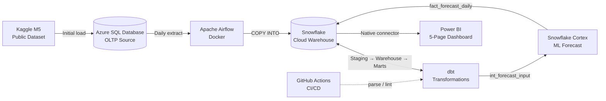
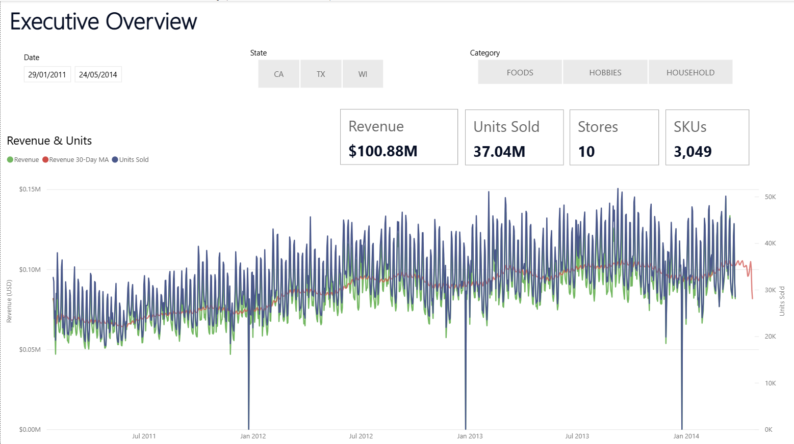
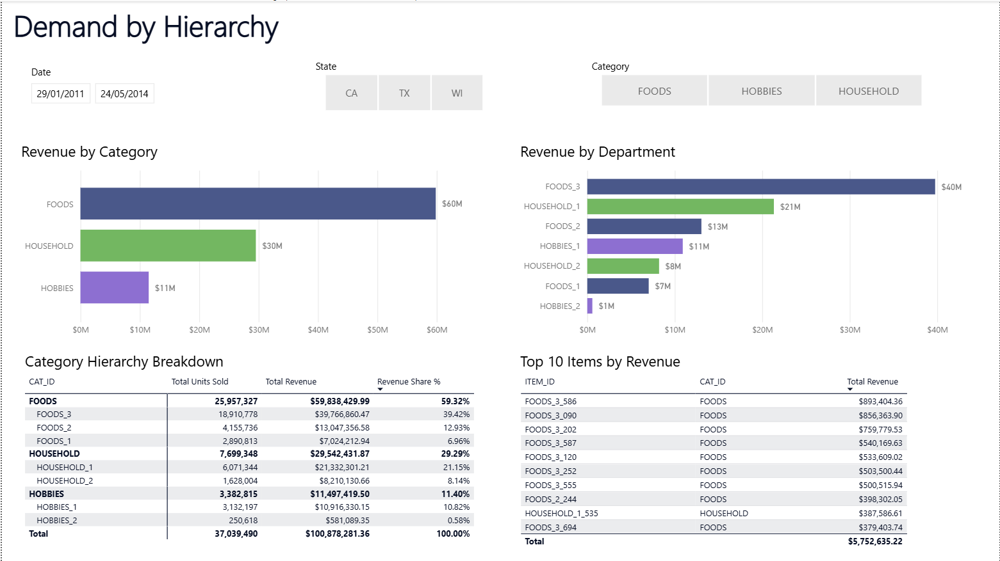
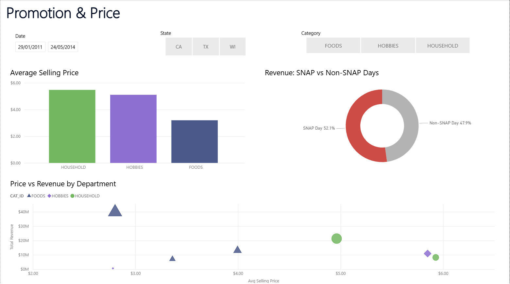
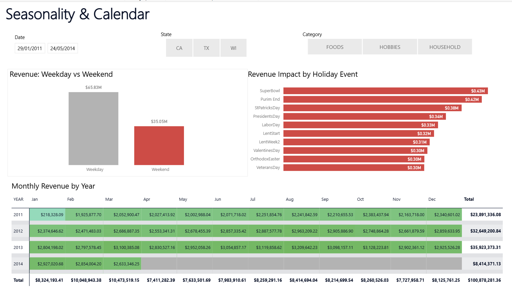
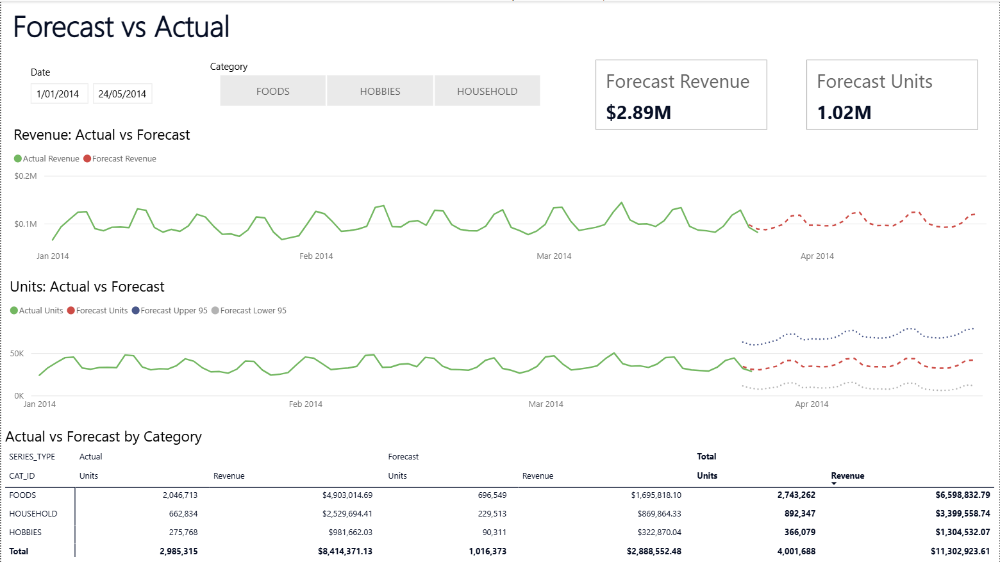

# retail-demand-forecasting-project

> Hybrid Microsoft + modern-data-stack retail demand-planning platform — real
> Walmart M5 sales ingested from Azure SQL Database into Snowflake via Airflow,
> transformed through a Kimball star schema with dedicated marts in dbt,
> forecast with Snowflake Cortex, and surfaced as a five-page Power BI dashboard
> for an operations / S&OP audience.
> Project #2 of Phil's data engineering portfolio.

**Status: COMPLETE — 2026-05-22.** End-to-end and interview-ready: Azure SQL Database → Snowflake `RAW` → dbt `STAGING` / `INTERMEDIATE` / `WAREHOUSE` / `MARTS` → Snowflake Cortex ML forecast → five-page Power BI dashboard, orchestrated on an Apache Airflow (Docker) DAG with per-model lineage via Astronomer Cosmos. Full Kimball star schema (incremental `fact_daily_sales` at 32.9M rows / $100.7M revenue), two pre-aggregated marts, a 28-day Cortex forecast for ~3K items conformed into the warehouse star and UNIONed with actuals, plus GitHub Actions CI (`dbt parse` + `sqlfluff` + `ruff` F821). Full build history, design decisions and the lessons log live in `PROJECT_CONTEXT.md` and `LEARNINGS.md`.

## What this project demonstrates

- **End-to-end pipeline** from an operational source database (Azure SQL) to a BI dashboard
- **Cloud warehouse** (Snowflake) fed from a **cloud-hosted OLTP source** (Azure SQL Database) — the realistic enterprise pattern of a relational ERP / Microsoft Dynamics-style source → cloud warehouse → BI tool
- **Orchestrated execution** via Apache Airflow (Docker), with independent Snowflake-side verification tasks that catch silent failures inside the DAG
- **Per-model dbt lineage in Airflow** via Astronomer Cosmos — Cosmos parses the dbt project at DAG-parse time and generates one Airflow task per dbt model and per test, so the Graph view shows the dbt DAG directly and a failing model surfaces as a single red task linked to its dbt logs
- **Production-grade dbt** with `dbt_utils`, tests, packages, partitioned incremental fact models, and a lean marts layer (pre-aggregations where they earn their keep; the warehouse star otherwise exposed directly to BI)
- **Kimball star schema at scale, by design** — deliberately dimensional modelling rather than a lakehouse / medallion approach (reserved for Project #3); the M5 dataset (~58M daily-sales rows across 30,000 SKUs and 10 stores) makes partitioning, incremental loads and pre-aggregated marts genuinely necessary rather than ceremonial
- **Time-series forecasting layer** — a Snowflake Cortex 28-day forecast conformed into the warehouse star (`fact_forecast_daily`) and joined to actuals via a dedicated `mart_forecast_vs_actual` model, surfacing the headline business question on the dashboard ("how is reality tracking against the forecast?") with full lineage back through the pipeline
- **Five-page Power BI dashboard** — Executive Overview, Demand by Hierarchy, Promotion & Price, Seasonality & Calendar, Forecast vs Actual
- **GitHub Actions CI** — `dbt parse` + `sqlfluff` lint + `ruff` F821 Python lint on every push and PR (`dbt test` deliberately run locally to avoid burning pay-as-you-go Snowflake credits)

## Architecture



## Stack

| Layer | Choice |
|---|---|
| Source database | Azure SQL Database (Serverless General Purpose, auto-pause) |
| Dataset | M5 Forecasting (Kaggle public dataset — Walmart sales 2011–2016) |
| Orchestration | Apache Airflow (Docker, LocalExecutor) |
| Cloud warehouse | Snowflake |
| Transformation | dbt (`dbt-snowflake`, `dbt_utils`) |
| Forecasting | Snowflake Cortex ML (`FORECAST`) |
| BI | Power BI Desktop (Import mode) |
| Version control | Git + GitHub |
| CI/CD | GitHub Actions (`dbt parse`, `sqlfluff`, `ruff` F821) |

## Project structure

```
retail-demand-forecasting-project/
├── scripts/                # Python: M5 load, Azure→Snowflake extract, smoke tests
│   ├── load_m5_to_azure_sql.py     # Kaggle M5 download → Azure SQL source tables
│   ├── create_raw_tables.py        # Snowflake RAW table DDL runner
│   ├── extract_azure_to_snowflake.py  # incremental Azure SQL → Snowflake RAW (COPY INTO)
│   └── smoke_test_*.py             # Azure SQL + Snowflake connectivity checks
├── airflow/                # Local Airflow stack (Docker)
│   ├── Dockerfile          # apache/airflow 2.10.3 + MS ODBC 17 + project deps
│   ├── docker-compose.yml  # postgres + init + webserver + scheduler (LocalExecutor)
│   └── dags/m5_daily_extract.py    # extract → verify → dbt (Cosmos) → verify
├── dbt/                    # dbt-snowflake project
│   ├── models/
│   │   ├── staging/        # stg_* (RAW → typed views)
│   │   ├── intermediate/   # int_sales_with_prices, int_forecast_input
│   │   ├── warehouse/      # Kimball star: dim_calendar / dim_item / dim_store,
│   │   │                   #   incremental fact_daily_sales, fact_forecast_daily
│   │   └── marts/          # agg_sales_daily, agg_sales_daily_item_cat,
│   │                       #   mart_forecast_vs_actual
│   ├── macros/             # generate_schema_name override
│   └── dbt_project.yml / profiles.yml / packages.yml
├── sql/                    # provisioning + verification query packs
│   ├── ddl/                # Azure SQL raw-table DDL
│   ├── snowflake/          # 00 provision → 05 train Cortex forecast model
│   └── verify/             # per-phase verification queries
├── powerbi/                # retail_demand_forecasting.pbix + .vpax + screenshots/
├── .github/workflows/      # dbt-ci.yml (parse + sqlfluff), lint-python.yml (ruff F821)
└── *.md                    # PROJECT_PLAN, PROJECT_CONTEXT, *_PIPELINE walkthroughs, LEARNINGS
```

## How this project was built

This project was built using AI-assisted pair programming (Claude by Anthropic).
All architecture decisions, technology selections, and final design choices are
my own; the AI accelerated implementation and acted as a senior-DE code reviewer.
The intent of the project is portfolio learning — every component was built with
explicit understanding of what it does and why. Layer-by-layer walkthroughs live
in the `*_PIPELINE.md` files; decision records and diagnosis → fix → lesson loops
are in `LEARNINGS.md`.

## Project documents

- `PROJECT_PLAN.md` — locked stack, scope, phase delivery plan, risks
- `PROJECT_CONTEXT.md` — running session state + full build history
- `EXTRACT_PIPELINE.md` / `DBT_PIPELINE.md` / `POWERBI_PIPELINE.md` — layer-by-layer walkthroughs
- `CODE_QUALITY.md` — the 10-point per-script code-quality checklist applied across the repo
- `POWERBI_PLAYBOOK.md` — Power BI build playbook (storage modes, measures, page polish)
- `GLOSSARY.md` — project terminology
- `LEARNING_ROADMAP.md` — phase-by-phase learning roadmap
- `LEARNINGS.md` — diagnosis → fix → lesson loops across SQL, Snowflake, Python, dbt, Airflow, Power BI and CI

## Dashboard

Five interactive pages built in Power BI Desktop on the dbt marts in Snowflake.
Import storage mode — the `.pbix` opens standalone for reviewers, no Snowflake
connection required (data baked into the file). Live report:
`powerbi/retail_demand_forecasting.pbix`.

### Executive Overview



Top-of-funnel KPIs across the M5 dataset (Revenue, Units Sold, Stores, SKUs) plus
a daily revenue trend with a dashed 30-day moving-average overlay. The landing
page — headline numbers and the long-term shape of the business in one glance.

### Demand by Hierarchy



Revenue cuts across the category → department → item hierarchy. The bar charts set
the FOODS / HOUSEHOLD / HOBBIES split (FOODS dominates at $60M / 59% of revenue);
the matrix drills into department-level share; the Top 10 Items table confirms the
classic retail long-tail — even the top 10 SKUs concentrate only ~5.7% of total
revenue.

### Promotion & Price



Price-elasticity and SNAP-day story. Average selling price by category (HOUSEHOLD
highest, FOODS lowest); the donut shows SNAP-benefit days drive 52% of revenue from
~33% of calendar days; the scatter exposes FOODS_3 as the cheap-price / high-volume
outlier — classic price-elasticity in one chart.

### Seasonality & Calendar



Calendar effects on demand. Weekday vs Weekend bars show weekend revenue
over-indexes ~33% per day; the Holiday Events bar surfaces SuperBowl as the
strongest single-day uplift; the Year × Month heatmap (green sequential gradient)
makes year-on-year revenue growth legible across the 2011-2014 history (~50% lift
from 2011 to 2013).

### Forecast vs Actual



Where the project's ML layer lands in the dashboard. Forecast Revenue and Forecast
Units KPI cards top-right; the Revenue and Units line charts show actuals (solid
green) plus dbt-produced Cortex forecasts (dashed red), with 95% confidence
intervals (dotted) on the Units chart; the matrix at the bottom splits actual vs
forecast by category.

## Related projects

Part of a three-project data-engineering portfolio:

- **Project #1 — CDC NT Transport Analytics** — dbt-first pipeline on PostgreSQL → Power BI; Kimball modelling foundation.
- **Project #2 — Retail Demand & Forecasting** *(this one)* — cloud warehouse + orchestration: Azure SQL → Snowflake → Airflow (Docker) → dbt → Power BI, with a Cortex forecast layer.
- **Project #3 — S&P 100 Financial Analytics Lakehouse** — AWS-native lakehouse: S3 + Glue + Athena + Iceberg, dbt-athena, Step Functions, 6-page Power BI, keyless OIDC CI/CD.

## Author

Phil McKechnie — Business Intelligence Analyst & Developer, Melbourne. 15+ years across operations, supply chain and analytics; the last 5 in dedicated BI roles (SQL, Tableau, Power BI). Building a data-engineering portfolio across dbt, cloud warehouses and AWS-native lakehouse work.
