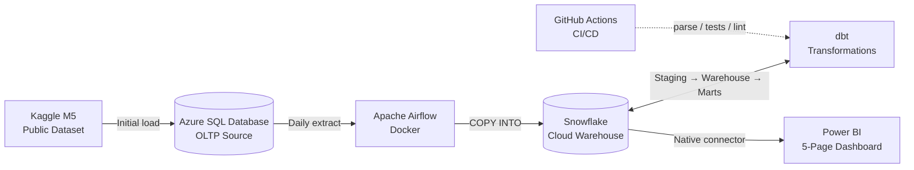

# Retail Demand & Forecasting Pipeline

> A production-grade retail demand-planning analytics platform built on a hybrid Microsoft + modern-data-stack architecture. Real Walmart sales data (M5 Forecasting) is ingested from Azure SQL Database into Snowflake via scheduled Airflow jobs, transformed through a partitioned star schema with dedicated marts using dbt, and surfaced as a five-page Power BI dashboard for an operations / S&OP audience.

**Status:** 🚧 In development — **Phase 5 session 5.4 closed; pages 2-5 next (5.5).** End-to-end orchestrated pipeline live: Azure SQL → Snowflake RAW → STAGING / INTERMEDIATE / WAREHOUSE / MARTS via dbt, all running on a single `@daily` Airflow schedule with per-model lineage visibility via **Astronomer Cosmos**. Full Kimball star schema shipped (`dim_calendar` extended to cover forecast horizon, `dim_item`, `dim_store`, incremental `fact_daily_sales` at 32.9M rows / $100.7M revenue). Two pre-aggregated marts in dbt+Snowflake (`agg_sales_daily`, `agg_sales_daily_item_cat`) follow the Kimball aggregate pattern. **Snowflake Cortex ML forecast layer live**: 28-day forecast for 3K items via `method='best' + evaluate=TRUE`, conformed to the warehouse star (`fact_forecast_daily`) and UNIONed with actuals (`mart_forecast_vs_actual`) for the Forecast vs Actual page. **Power BI semantic model built**: 8 tables imported, 20 DAX measures on a dedicated `_Measures` table, Executive Overview page complete with 4 KPI cards + dual-line trend chart. Pages 2-5 build next.

---

## What this project demonstrates

- **End-to-end pipeline** from operational source database to BI dashboard
- **Cloud warehouse** (Snowflake) and **cloud-hosted source** (Azure SQL Database)
- **Orchestrated execution** via Apache Airflow (Docker), with independent Snowflake-side verification tasks that catch silent failures inside the DAG
- **Per-model dbt lineage in Airflow** via Astronomer Cosmos — Cosmos parses the dbt project at DAG-parse time and generates one Airflow task per dbt model + per test, so the Airflow Graph view shows the dbt DAG directly and a failing model surfaces as a single red task with a link to its dbt logs
- **Production-grade dbt** with `dbt_utils`, tests, packages, partitioned incremental fact models, and a lean-marts layer (pre-aggregations where they earn their keep; warehouse star otherwise exposed directly to BI)
- **Realistic enterprise pattern**: relational source (representing an ERP / Microsoft Dynamics system) → cloud warehouse → BI tool
- **Five-page Power BI dashboard** — Executive Overview, Demand by Hierarchy, Promotion & Price, Seasonality & Calendar, Forecast vs Actual (with a working forecasting layer, not a stub)
- **Time-series forecasting layer** built end-to-end and joined to actuals via a dedicated `mart_forecast_vs_actual` dbt model — surfaces the headline business question on the dashboard ("how is reality tracking against the forecast?") with full lineage back through the pipeline
- **GitHub Actions CI**: `dbt parse` + `dbt test` + dbt slim CI + `sqlfluff` lint + markdown lint on every PR. `dbt docs generate` hosted on GitHub Pages

---

## Architecture

---

## Tech stack

| Layer           | Tool                                                             |
| --------------- | ---------------------------------------------------------------- |
| Source database | Azure SQL Database (Serverless General Purpose, auto-pause)      |
| Dataset         | M5 Forecasting (Kaggle public dataset — Walmart sales 2011–2016) |
| Orchestration   | Apache Airflow (Docker)                                          |
| Cloud warehouse | Snowflake                                                        |
| Transformations | dbt (`dbt-snowflake`, `dbt_utils`)                               |
| BI              | Power BI Desktop                                                 |
| Version control | Git + GitHub                                                     |
| CI/CD           | GitHub Actions (`dbt parse`, tests, `sqlfluff` lint)             |

---

## Architecture pattern

**Kimball star schema** with a dedicated **marts layer** above it, partitioned and incremental fact tables. Deliberately a different scope from a lakehouse / medallion approach (reserved for a future project) — this one focuses on production-grade dimensional modelling at scale.

---

## Domain context

Retail demand planning and S&OP operations. The pipeline serves use cases an operations team would care about day-to-day: daily sales tracking, sell-through, promotion impact, seasonality patterns, forecast vs actual.

The M5 dataset (~58M rows of daily sales across 30,000 SKUs and 10 stores) is large enough to make engineering patterns like partitioning, incremental loads, and pre-aggregated marts genuinely necessary rather than ceremonial.

---

## Project documentation

- **`PROJECT_PLAN.md`** — full plan, scope, timeline, locked decisions, risks
- **`PROJECT_CONTEXT.md`** — current state and immediate next steps
- **`EXTRACT_PIPELINE.md`** — Phase 2 walkthrough: Azure SQL → Snowflake extract path, design decisions, throughput economics
- **`DBT_PIPELINE.md`** — Phase 4 walkthrough: dbt project layout, `dbt_project.yml` / `profiles.yml` line-by-line, materialization strategy per layer, plus the Airflow ↔ dbt integration via Astronomer Cosmos (per-model task generation, four-stage DAG chain, failure-injection validation)
- **`CODE_QUALITY.md`** — the 10-point code-quality checklist (7 core checks + 3 failsafes) applied to every non-trivial script in this repo, with concrete examples from the codebase
- **`LEARNINGS.md`** — running journal of lessons learned across the project
- **`TEACHING_PREFERENCES.md`** — working-style preferences (relevant to AI-assisted development workflow)

---

## How to run this

_(to be populated during Phase 6 — will include setup steps for Azure SQL Database, Snowflake account, Airflow Docker, dbt configuration, and Power BI connection)_

---

## Dashboard

_(to be populated during Phase 5 — screenshots of all five Power BI pages)_

---

## Key learnings

_(to be populated through the project — see `LEARNINGS.md` for the full running journal)_

---

## Predecessor project

This is the second project in a portfolio progression:

- **Project #1 — CDC NT Transport** — End-to-end pipeline foundation: Postgres + dbt + Power BI. Demonstrates Kimball dimensional modelling, multi-source surrogate keys, BI integration
- **Project #2 — Retail Demand & Forecasting Pipeline** _(this one)_ — Production-grade pipeline: cloud warehouse, orchestration, partitioning, incremental loads, marts
- **Project #3 — TBD** — Lakehouse / streaming / ML feature store (direction to be decided after Project #2)

---

## Author

Phil — transitioning from BI / Data Analyst into Data Engineering. Background: 4 years BI (Tableau, PostgreSQL, limited Power BI), Over 10 years operations and demand planning experience.
