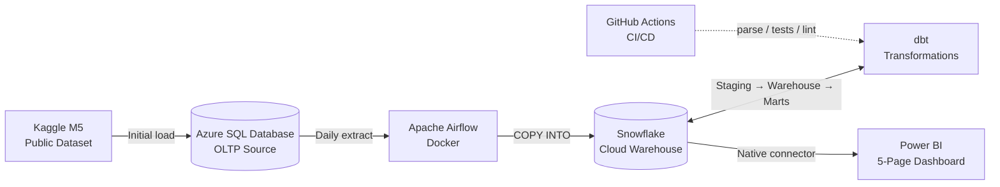

# Retail Demand & Forecasting Pipeline

> A production-grade retail demand-planning analytics platform built on a hybrid Microsoft + modern-data-stack architecture. Real Walmart sales data (M5 Forecasting) is ingested from Azure SQL Database into Snowflake via scheduled Airflow jobs, transformed through a partitioned star schema with dedicated marts using dbt, and surfaced as a five-page Power BI dashboard for an operations / S&OP audience.

**Status:** 🚧 In development — **Phase 5 session 5.4 closed; pages 2-5 next (5.5).** End-to-end orchestrated pipeline live: Azure SQL → Snowflake RAW → STAGING / INTERMEDIATE / WAREHOUSE / MARTS via dbt, all running on a single `@daily` Airflow schedule with per-model lineage visibility via **Astronomer Cosmos**. Full Kimball star schema shipped (`dim_calendar` extended to cover forecast horizon, `dim_item`, `dim_store`, incremental `fact_daily_sales` at 32.9M rows / $100.7M revenue). Two pre-aggregated marts in dbt+Snowflake (`agg_sales_daily`, `agg_sales_daily_item_cat`) follow the Kimball aggregate pattern. **Snowflake Cortex ML forecast layer live**: 28-day forecast for 3K items via `method='best' + evaluate=TRUE`, conformed to the warehouse star (`fact_forecast_daily`) and UNIONed with actuals (`mart_forecast_vs_actual`) for the Forecast vs Actual page. **Power BI semantic model built**: 8 tables imported, 20 DAX measures on a dedicated `_Measures` table, Executive Overview page complete with 4 KPI cards + dual-line trend chart. Pages 2-5 build next.

---

## What this project demonstrates

- **End-to-end pipeline** from operational source database to BI dashboard
- **Cloud warehouse** (Snowflake) and **cloud-hosted source** (Azure SQL Database)
- **Orchestrated execution** via Apache Airflow (Docker), with independent Snowflake-side verification tasks that catch silent failures inside the DAG
- **Per-model dbt lineage in Airflow** via Astronomer Cosmos — Cosmos parses the dbt project at DAG-parse time and generates one Airflow task per dbt model + per test, so the Airflow Graph view shows the dbt DAG directly and a failing model surfaces as a single red task with a link to its dbt logs
- **Production-grade dbt** with `dbt_utils`, tests, packages, partitioned incremental fact models, and a lean-marts layer (pre-aggregations where they earn their keep; warehouse star otherwise exposed directly to BI)
- **Realistic enterprise pattern**: relational source (representing an ERP / Microsoft Dynamics system) → cloud warehouse → BI tool
- **Five-page Power BI dashboard** — Executive Overview, Demand by Hierarchy, Promotion & Price, Seasonality & Calendar, Forecast vs Actual (with a working forecasting layer, not a stub)
- **Time-series forecasting layer** built end-to-end and joined to actuals via a dedicated `mart_forecast_vs_actual` dbt model — surfaces the headline business question on the dashboard ("how is reality tracking against the forecast?") with full lineage back through the pipeline
- **GitHub Actions CI**: `dbt parse` + `dbt test` + dbt slim CI + `sqlfluff` lint + markdown lint on every PR. `dbt docs generate` hosted on GitHub Pages

---

## Architecture

---

## Tech stack

| Layer           | Tool                                                             |
| --------------- | ---------------------------------------------------------------- |
| Source database | Azure SQL Database (Serverless General Purpose, auto-pause)      |
| Dataset         | M5 Forecasting (Kaggle public dataset — Walmart sales 2011–2016) |
| Orchestration   | Apache Airflow (Docker)                                          |
| Cloud warehouse | Snowflake                                                        |
| Transformations | dbt (`dbt-snowflake`, `dbt_utils`)                               |
| BI              | Power BI Desktop                                                 |
| Version control | Git + GitHub                                                     |
| CI/CD           | GitHub Actions (`dbt parse`, tests, `sqlfluff` lint)             |

---

## Architecture pattern

**Kimball star schema** with a dedicated **marts layer** above it, partitioned and incremental fact tables. Deliberately a different scope from a lakehouse / medallion approach (reserved for a future project) — this one focuses on production-grade dimensional modelling at scale.

---

## Domain context

Retail demand planning and S&OP operations. The pipeline serves use cases an operations team would care about day-to-day: daily sales tracking, sell-through, promotion impact, seasonality patterns, forecast vs actual.

The M5 dataset (~58M rows of daily sales across 30,000 SKUs and 10 stores) is large enough to make engineering patterns like partitioning, incremental loads, and pre-aggregated marts genuinely necessary rather than ceremonial.

---

## Project documentation

- **`PROJECT_PLAN.md`** — full plan, scope, timeline, locked decisions, risks
- **`PROJECT_CONTEXT.md`** — current state and immediate next steps
- **`EXTRACT_PIPELINE.md`** — Phase 2 walkthrough: Azure SQL → Snowflake extract path, design decisions, throughput economics
- **`DBT_PIPELINE.md`** — Phase 4 walkthrough: dbt project layout, `dbt_project.yml` / `profiles.yml` line-by-line, materialization strategy per layer, plus the Airflow ↔ dbt integration via Astronomer Cosmos (per-model task generation, four-stage DAG chain, failure-injection validation)
- **`CODE_QUALITY.md`** — the 10-point code-quality checklist (7 core checks + 3 failsafes) applied to every non-trivial script in this repo, with concrete examples from the codebase
- **`LEARNINGS.md`** — running journal of lessons learned across the project
- **`TEACHING_PREFERENCES.md`** — working-style preferences (relevant to AI-assisted development workflow)

---

## How to run this

_(to be populated during Phase 6 — will include setup steps for Azure SQL Database, Snowflake account, Airflow Docker, dbt configuration, and Power BI connection)_

---

## Dashboard

Five interactive pages built in Power BI Desktop on top of the dbt marts in Snowflake. All-Import storage mode — the `.pbix` opens standalone for portfolio reviewers (data baked into the file).

### Executive Overview

Top-of-funnel KPIs across the M5 dataset (Revenue, Units Sold, Stores, SKUs) plus a daily revenue trend with a dashed 30-day moving average overlay. The landing page — headline numbers and the long-term shape of the business in one glance.

### Demand by Hierarchy

Revenue cuts across the category → department → item hierarchy. The bar charts set the FOODS / HOUSEHOLD / HOBBIES split (FOODS dominates at $60M / 59% of revenue); the matrix drills into department-level share; the Top 10 Items table confirms the classic retail long-tail — even the top 10 SKUs concentrate only ~5.7% of total revenue.

### Promotion & Price

Price-elasticity and SNAP-day story. Average selling price by category (HOUSEHOLD highest, FOODS lowest); the donut shows SNAP-benefit days drive 52% of revenue from ~33% of calendar days; the scatter exposes FOODS_3 as the cheap-price / high-volume outlier — classic price-elasticity in one chart.

### Seasonality & Calendar

Calendar effects on demand. Weekday vs Weekend bars show weekend revenue over-indexes ~33% per day; the Holiday Events bar surfaces SuperBowl as the strongest single-day uplift; the Year × Month heatmap (green sequential gradient) makes year-on-year revenue growth legible across the 2011-2014 history (~50% lift from 2011 to 2013).

### Forecast vs Actual

Where the project's ML layer lands in the dashboard. Forecast Revenue and Forecast Units KPI cards top-right; the Revenue and Units line charts show actuals (solid green) plus dbt-produced forecasts (dashed red), with 95% confidence intervals (dotted) on the Units chart; the matrix at the bottom splits actual vs forecast by category.

---

## Demo & future revival

The `.pbix` is Import-mode — opening the file demos the entire dashboard standalone with data baked into the VertiPaq cache. Portfolio reviewers get the full BI deliverable by opening the file in Power BI Desktop, no Snowflake connection required.

For a **live refresh demo** 30+ days out (after the Snowflake free-trial credits expire), the revival path is pay-as-you-go on Snowflake Standard for one week the week before the interview (~$5 expected spend on an XSMALL warehouse with 60s auto-suspend). Open `.pbix` → Home → Refresh → re-authenticate to Snowflake → data pulls live from `WAREHOUSE` + `MARTS`. Optional end-to-end demo: trigger `m5_daily_extract` for a fresh `logical_date` in Airflow, watch the 4 tasks go green, refresh PBI, show the new row in the Data view.

See [`POWERBI_PIPELINE.md`](POWERBI_PIPELINE.md) → *Future revival for interview demo* for the full cost ceiling and demo flow.

---

## Key learnings

See [`LEARNINGS.md`](LEARNINGS.md) for the full running journal — 30+ entries across SQL, Snowflake, Python, dbt, Airflow, Power BI, and CI domains. Headline takeaways from this project:

- **Composite-mode storage forced by `.pbix` file size.** Full-Import on a 33M-row fact produced a 949 MB `.pbix`, exceeding GitHub's 100 MB per-file push limit. Pivot to DirectQuery on the fact + Import on dims dropped the file to 264 KB. Later reverted to all-Import after column-pruning the fact (see POWERBI_PIPELINE.md for the full architectural arc).
- **User-defined aggregations require DirectQuery on the detail table.** Microsoft Learn surfaced this constraint after we'd built the agg marts in dbt. UDA is architecturally incompatible with all-Import — the agg marts ship with the repo as portfolio-narrative artefacts.
- **Airflow `schedule=None` for portfolio-demo DAGs.** Unpausing a `@daily` DAG auto-spawns a phantom run for the missed scheduled interval. For demo work, `schedule=None` means the operator controls every run via "Trigger DAG w/ config" — no phantom runs, no failed extracts against missing dates.
- **NEVER pause an Airflow DAG mid-run.** The scheduler strands tasks in "scheduled" state indefinitely. Sequence is always unpause → trigger → let it complete → THEN pause.
- **When 3 things look broken at once, suspect ONE root cause.** Phase 5.5 opened with empty slicers, broken KPI cards, and refresh-time cyclic-ref errors — three apparently independent failures, all downstream of Pause Visuals being on. One click fixed all three.
- **PBI Optimize → Pause Visuals is the FIRST diagnostic** when symptoms include "things blank on click" or "needs refresh after every change". 1-click toggle, highest-signal PBI diagnostic.
- **Snowflake unquoted identifiers store as UPPERCASE.** dbt's lowercase source → Snowflake's uppercase catalog → PBI's uppercase column names. DAX is case-insensitive but bare names still need to match the catalog — trust Intellisense.
- **PBI calculated COLUMN vs MEASURE** evaluate in different contexts. The "Cannot find name [column]" error on a visible column is the canonical symptom of clicking New measure when you wanted New column.
- **Transformation layer hierarchy: dbt → Power Query → DAX → visual.** Do data cleanup at the lowest possible layer. The model has one PQ `Text.Proper` step on a mart column that couldn't be normalised upstream because the dbt source needs the lowercase value for its own use; every other transformation is in dbt.
- **Scan ALL references when surgically removing a variable from a function.** SQL query, bind tuple, unpack line, log calls, success-path return f-string, failure-check block. The success-path return is the easy-to-miss case because it only executes on the happy path — exactly the path that hasn't been exercised since the modification. Caught with `ruff F821` in CI as defense-in-depth.

---

## Predecessor project

This is the second project in a portfolio progression:

- **Project #1 — CDC NT Transport** — End-to-end pipeline foundation: Postgres + dbt + Power BI. Demonstrates Kimball dimensional modelling, multi-source surrogate keys, BI integration
- **Project #2 — Retail Demand & Forecasting Pipeline** _(this one)_ — Production-grade pipeline: cloud warehouse, orchestration, partitioning, incremental loads, marts
- **Project #3 — TBD** — Lakehouse / streaming / ML feature store (direction to be decided after Project #2)

---

## Author

Phil — transitioning from BI / Data Analyst into Data Engineering. Background: 4 years BI (Tableau, PostgreSQL, limited Power BI), Over 10 years operations and demand planning experience.
